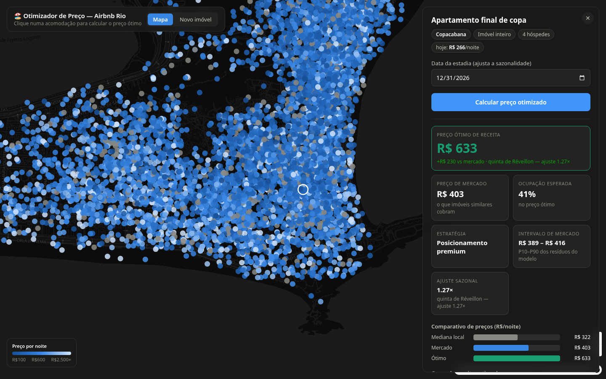

# Airbnb Price Optimizer — Rio de Janeiro

Aplicação de ML de ponta a ponta para **otimização de preço** de acomodações do Airbnb no Rio de Janeiro: um mapa interativo com as 43 mil acomodações da cidade — clique em qualquer uma, escolha a data da estadia e receba o `revenue_optimal_price`, o preço que maximiza a receita esperada (preço × ocupação), com ajuste para Réveillon, Carnaval e fim de semana.

**🔗 Demo ao vivo:** https://caio-fis-airbnb-price-optimizer-rio.hf.space
*(Hugging Face Spaces — o container dorme após inatividade e acorda em ~30s)*



---

## O que o app faz

- **Mapa (MapLibre GL)**: 43k acomodações coloridas por preço/noite. Clique → painel com o imóvel, data da estadia e botão **Calcular preço otimizado**.
- **Novo imóvel**: precifica um endereço que ainda não está no Airbnb (geocoding Nominatim + snap de bairro).
- **Resultado**: preço ótimo de receita, benchmark de mercado, ocupação esperada, estratégia de precificação, ajuste sazonal da data e curva de receita estimada.

| Campo da API | Descrição |
|---|---|
| `predicted_price` | Benchmark de mercado — o que imóveis similares cobram |
| `revenue_optimal_price` | Preço que maximiza receita esperada (preço × ocupação) |
| `expected_occupancy_pct` | Ocupação estimada (%) no preço ótimo |
| `pricing_strategy` | `revenue_optimal` / `premium_positioning` / `fallback` |
| `seasonal_multiplier` | Fator da data (dia da semana × evento), ex.: Réveillon 1.27× |
| `local_median_price` | P50 do segmento (bairro × tipo de quarto) |
| `price_range_low/high` | Intervalo data-driven (P10/P90 dos resíduos OOF) |

---

## Features do modelo

O modelo considera três camadas de variáveis, todas computáveis tanto no treino quanto na inferência (paridade garantida por teste):

**Interior do imóvel** — quartos, banheiros (incl. lavabo como 0.5), camas, hóspedes, tipo de quarto, comodidades (Wi-Fi, piscina, ar-condicionado…), perfil do anfitrião.

**Vizinhança (OpenStreetMap)** — para cada acomodação, distância e densidade em 500m de **8 categorias de POI**: bares, restaurantes, cafés/padarias, academias, parques, supermercados, atrações turísticas e casas noturnas — além de distância a praias/orla, metrô, Cristo, aeroportos, Lapa e Maracanã. Implementado com `BallTree` haversine; a mesma função roda no pipeline offline e no serving.

**Qualidade da região (IPS 2022 — IPP/data.rio)** — Índice de Progresso Social por bairro: índice geral, **segurança pessoal** e renda per capita. A segurança do bairro é a 7ª feature mais importante do modelo. Matching de 152 bairros do Inside Airbnb com 99,8% de cobertura.

### Anti-leakage

O treino exclui explicitamente qualquer variável derivada de preço/ocupação do painel (`price_premium`, `revenue_optimal_price`, `estimated_revenue_l365d`…) — elas vazavam o alvo e não existem na inferência. A correção desse skew treino/serving eliminou uma subprecificação sistemática (~2× em bairros caros).

---

## Preço por dia (camada sazonal)

O calendário do Inside Airbnb para o Rio publica a coluna de preço 100% nula — **não existe preço diário real**. O efeito da data é uma camada multiplicativa pós-modelo estimada da **ocupação real** (1 − disponibilidade, 15M linhas):

- **Dia da semana**: sexta/sábado ≈ +2% de demanda.
- **Eventos**: ocupação no evento vs linha de base local (±21 dias) — isso cancela o artefato de horizonte de reserva (datas distantes parecem vazias só porque ninguém reservou ainda). Resultado: **Réveillon 1.60×** e **Carnaval 1.34×** de demanda.
- Conversão demanda→preço com elasticidade amortecida (`índice^0.5`, clip [0.8, 2.5]) — premissa documentada no código.
- Feriados detectados para qualquer ano futuro via `holidays` (BR-RJ).

O fator de **mês** deliberadamente não é estimado: com 15 meses de calendário, o efeito de alta temporada não é separável do artefato de horizonte.

---

## Estimação de demanda (curva de elasticidade)

Os **dois snapshots** (Jun/2025 → Set/2025) permitem estimar elasticidade-preço por segmento (bairro × tipo de quarto):

```
Δlogit(occupancy) ~ b × Δlog(price)
```

| Estratégia | Condição | Como funciona |
|---|---|---|
| `revenue_optimal` | `b < -1` (elástica) | Grid search: `argmax[ price × sigmoid(a + b·log(price/p50)) ]` |
| `premium_positioning` | `-1 ≤ b < 0` (inelástica) | Sobe até o P75 local — perde pouca ocupação, ganha margem |
| `fallback` | Dados insuficientes | Retorna a mediana local |

256 segmentos com parâmetros estimados.

---

## Modelo

- **Campeão: XGBoost** (vs LightGBM, 5-fold CV) — target `log(price)`
- **65 features** honestas (sem leakage, todas disponíveis na inferência)

| Modelo | OOF RMSE (R$) | OOF MAE (R$) |
|---|---|---|
| **XGBoost** | **103.73** | **19.33** |
| LightGBM | 105.79 | 21.60 |

- **Tracking:** MLflow (runs, métricas por fold, artefatos)
- **Intervalo de confiança:** P10/P90 dos resíduos out-of-fold

---

## Arquitetura

```
Inside Airbnb (Jun + Set 2025)      OSM (Overpass)      data.rio (IPS 2022)
        │                                │                      │
        ▼                                ▼                      ▼
┌────────────────────────────────────────────────────────────────────┐
│  Feature pipelines (Airflow / dvc repro)                           │
│  tabular · geo+POIs · competição · demanda · bairro · sazonalidade │
│  → final_features.parquet + artefatos de inferência (.joblib/json) │
└──────────────────────────┬─────────────────────────────────────────┘
                           ▼
                 ┌──────────────────┐
                 │  Treino XGB/LGB  │ 5-fold CV → MLflow → models/model.joblib
                 └────────┬─────────┘
                          ▼
┌────────────────────────────────────────────────────────────────────┐
│  Container único (Hugging Face Spaces, porta 7860)                 │
│                                                                    │
│  FastAPI ──── POST /predict            (imóvel novo por endereço)  │
│          ──── POST /predict/listing    (listing real por id)       │
│          ──── GET  /listings/map       (GeoJSON 43k, gzip)         │
│          ──── /                        (frontend React buildado)   │
│                                                                    │
│  predict = modelo + curva de demanda + multiplicador sazonal       │
└────────────────────────────────────────────────────────────────────┘
                          ▲
                          │  build multi-stage (Node 22 → Python 3.12)
                    Dockerfile único
```

## Stack

| Camada | Tecnologia |
|---|---|
| Frontend | React 18 + Vite + MapLibre GL JS + Recharts |
| Serving | FastAPI + uvicorn + slowapi (rate limit) |
| Modelos | XGBoost, LightGBM |
| Feature engineering | pandas, scikit-learn (BallTree), osmnx, statsmodels, holidays |
| Orquestração | Apache Airflow (Docker Compose) · dvc repro |
| Tracking | MLflow |
| Monitoramento | Evidently AI ([relatório de drift Jun→Set](https://storage.googleapis.com/airbnb-rj-projectb0f/evidently/monitoring_drift_report.html)) |
| Deploy | Docker multi-stage → Hugging Face Spaces |
| Dados | DVC + GCS · [dashboard Looker Studio](https://lookerstudio.google.com/reporting/0e85626b-599a-46f6-a746-50db0329cc8b) |

---

## Como usar a API

```bash
# Listing real por id (com data da estadia)
curl -X POST https://caio-fis-airbnb-price-optimizer-rio.hf.space/predict/listing \
  -H "Content-Type: application/json" \
  -d '{"listing_id": 821198370698658112, "target_date": "2026-12-31"}'

# Imóvel novo por características
curl -X POST https://caio-fis-airbnb-price-optimizer-rio.hf.space/predict \
  -H "Content-Type: application/json" \
  -d '{
    "neighbourhood": "Copacabana",
    "room_type": "Entire home/apt",
    "accommodates": 4,
    "bathrooms": 2.0,
    "bedrooms": 2,
    "beds": 2,
    "amenities": ["wifi", "kitchen", "air conditioning"],
    "latitude": -22.9694,
    "longitude": -43.1809,
    "target_date": "2026-12-31"
  }'
```

**Resposta:**
```json
{
  "predicted_price": 406.07,
  "price_range_low": 392.75,
  "price_range_high": 419.6,
  "local_median_price": 322.0,
  "seasonal_note": "quinta de Réveillon — ajuste 1.27×",
  "seasonal_multiplier": 1.266,
  "revenue_optimal_price": 633.0,
  "expected_occupancy_pct": 40.8,
  "pricing_strategy": "premium_positioning"
}
```

---

## Como rodar localmente

```bash
# 1. API (usa os artefatos em models/ e data/processed/ — `dvc pull` para baixá-los)
pip install -r requirements-api.txt
make serve                      # uvicorn na porta 8000

# 2. Frontend
make frontend                   # npm install + build → frontend/dist (servido pela API)
# ou, para desenvolvimento com hot reload:
cd frontend && npm run dev      # Vite na 5173 com proxy para a API na 8000
```

### Container único (igual ao Space)
```bash
docker build -t airbnb-optimizer .
docker run -p 7860:7860 airbnb-optimizer
```

### Stack completa de treino (Airflow + MLflow)
```bash
cp .env.example .env
docker compose up
# Airflow: http://localhost:8080 · MLflow: http://localhost:5000
```

### Deploy no Hugging Face Spaces
```bash
hf auth login                   # uma vez
./scripts/deploy_hf.sh          # monta .hf-space/ e publica via API
```

---

## Notebooks

| Notebook | Conteúdo |
|---|---|
| `01_eda.ipynb` | EDA de listings e calendário — distribuições, sazonalidade, Jun vs Set |
| `02_feature_engineering.ipynb` | Validação de features: HW, target encoding, geo, estimação de demanda |
| `02_reviews_analysis.ipynb` | Sentimento, velocidade/recência, BERTopic |
| `03_modeling.ipynb` | XGBoost vs LightGBM, SHAP, análise de erros, pipeline de otimização |

## Dados

Fonte: [Inside Airbnb](http://insideairbnb.com/) (Rio de Janeiro) · [data.rio](https://www.data.rio/) (IPS 2022) · [OpenStreetMap](https://www.openstreetmap.org/) (POIs)

| Arquivo | Descrição |
|---|---|
| `listings_set2025.parquet` | 38.1k listings, Set/2025 (base de treino) |
| `calendar_jun/set2025.parquet` | 15.5M + 15.7M linhas — disponibilidade diária |
| `data/external/ips_bairros_2022.csv` | IPS por bairro (versionado no git) |
| `data/processed/geo_poi_*.json` | Caches de POIs OSM (usados também no serving) |

> Dados grandes não estão no git — use `dvc pull`.

## Estrutura do projeto

```
├── frontend/                # React + Vite + MapLibre (mapa, painel, form)
├── src/
│   ├── features/            # Pipelines: tabular, geo+POIs, bairro (IPS),
│   │                        #   competição, demanda, fatores sazonais
│   ├── serving/             # FastAPI (main, predict, schemas, security)
│   ├── training/            # Treino XGB/LGB + MLflow (EXCLUDE_COLS anti-leakage)
│   ├── ingestion/           # Download Inside Airbnb
│   └── monitoring/          # Evidently drift
├── dags/                    # Airflow DAGs
├── data/external/           # IPS por bairro + mapa de nomes (no git)
├── scripts/                 # build_map_listings, deploy_hf, check_bairro_match…
├── tests/                   # 55 testes (API, features, paridade, sazonal, modelo)
├── Dockerfile               # Multi-stage: Node (frontend) → Python (API)
└── docker-compose.yml       # Stack local de treino
```
